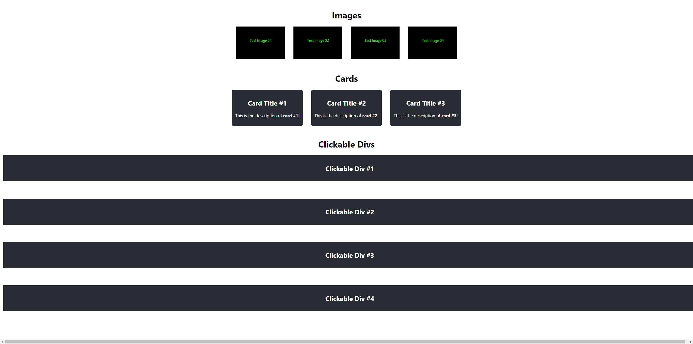

This is the website we've made for parsing and extracting data using Selenium and Beautiful Soup. The website utilizes React!

Please refer to the main [`README`](../README.md) for more information on how to set up this website.

The main website's source code may be found at [`src/App.tsx`](./src/App.tsx). The website's CSS file may be found at [`src/App.css`](./src/App.css).

## Website Content
### Image Rows
Image rows are inside of a `flex` divider with a gap of `2rem`. Each image is has a width of `180px` and a height of `120px`.

### Card Rows
Card rows are inside of a `flex` divider with a gap of `2rem`. Each card row contains a title and description. The title is inside of a `<h2>` tag while the description is inside of a `
` tag.

### Clickable Dividers
Clickable dividers are inside of a `flex` divider with a direction of `column` and a gap of `4rem`. The title is inside of a `<h2>` tag and the hidden contents are inside of a `
` tag that is hidden until the clickable divider is clicked.

## Preview
